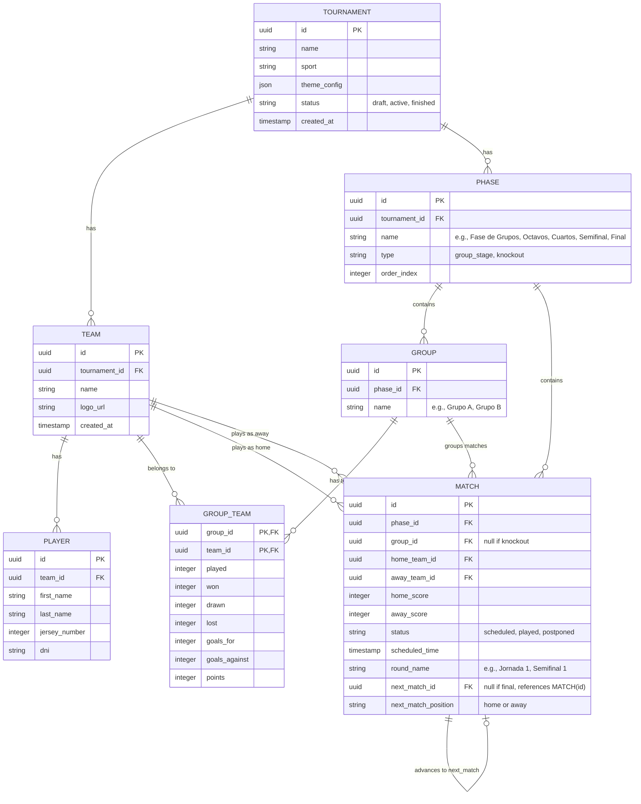

# Plan de Implementación: Gestor de Torneos Temáticos

Este plan detalla el diseño de la base de datos, el stack tecnológico propuesto y los componentes iniciales para el Gestor de Torneos Temáticos, comenzando con el caso de uso de Fútbol 7.

## 1. Arquitectura de Base de Datos

Proponemos una base de datos relacional (por ejemplo, PostgreSQL o SQLite) que se adapta perfectamente al dominio del torneo deportivo.



### Explicación de los Modelos
*   **Tournament (Torneo)**: Almacena los metadatos y la configuración del tema (colores, fuentes, logos) en `theme_config` para ser agnóstico.
*   **Team (Equipo) y Player (Jugador)**: Relación clásica uno a muchos.
*   **Phase (Fase)**: Permite estructurar el torneo en múltiples fases (ej. Fase de Grupos seguida de Eliminatorias).
*   **Group (Grupo) y GroupTeam (Tabla)**: Modela las tablas de clasificación de la liguilla.
*   **Match (Partido)**: Registra los marcadores. Para eliminatorias, `next_match_id` y `next_match_position` estructuran el flujo del árbol (bracket) de forma dinámica hacia la final.

---

## 2. Stack Tecnológico Sugerido

Para la exportación visual de alta calidad y una interfaz reactiva premium:

1.  **Frontend**: **React.js con TypeScript + Vite**
    *   *Razón*: Reutilización de componentes, tipado estricto para evitar errores en lógica deportiva y reactividad inmediata para el cambio de skins en tiempo real.
2.  **Motor Temático**: **CSS Custom Properties (Variables de CSS)**
    *   *Razón*: Rendimiento nativo. Al actualizar variables como `--primary-color`, `--font-main` en el elemento raíz (`:root` o un wrapper del torneo), todos los componentes hijos se repintan instantáneamente sin parpadeos ni carga de hojas de estilo adicionales.
3.  **Exportación a PDF/Imagen**:
    *   **Impresión Nativa (`@media print`)**: Es la mejor opción para PDFs vectoriales de alta resolución. Se configuran hojas de estilo CSS específicas que ocultan botones de navegación, expanden el contenido al ancho de página A4/Letter y aseguran saltos de página perfectos.
    *   **html2canvas + jsPDF**: Para descargas automáticas tipo "botón" en el cliente que generan una captura de pantalla PNG o un archivo PDF empaquetado directamente en el navegador sin abrir el diálogo de impresión.

---

## 3. Arquitectura del Motor Temático (Theme Engine)

El motor consumirá un JSON con esta estructura:

```json
{
  "tournamentName": "Torneo de Verano Fútbol 7",
  "sport": "Fútbol 7",
  "logoUrl": "https://example.com/logo.png",
  "theme": {
    "primaryColor": "#1b5e20",
    "secondaryColor": "#81c784",
    "backgroundColor": "#f1f8e9",
    "textColor": "#1b5e20",
    "cardBackgroundColor": "#ffffff",
    "fontFamily": "'Outfit', sans-serif"
  }
}
```

Un componente proveedor de React (`ThemeProvider`) inyectará dinámicamente estas variables en el DOM:

```css
:root {
  --primary-color: [primaryColor];
  --secondary-color: [secondaryColor];
  --background-color: [backgroundColor];
  --text-color: [textColor];
  --card-bg: [cardBackgroundColor];
  --font-family: [fontFamily];
}
```

---

## 4. Componente del Árbol de Cruces (Knockout Bracket)

Diseñaremos un componente visual interactivo para los cruces (Octavos -> Cuartos -> Semifinal -> Final) que se auto-ajuste según el número de clasificados. Usará conexiones CSS elegantes para dibujar las líneas de paso entre partidos.

---

## Plan de Trabajo para la Iteración 1

1.  **Inicialización del Proyecto**: Crear un proyecto de React con Vite y configurar la estructura de directorios.
2.  **Definición de Tipos y Mock Data**: Modelar las interfaces TypeScript de Torneo, Equipo, Partido, Fase y Tema.
3.  **Implementación del Motor Temático**: Crear el selector y cargador de JSON y la inyección dinámica de CSS variables.
4.  **Desarrollo de Vistas Visuales**:
    *   Formulario de Inscripción en blanco (estilizado).
    *   Clasificación de Fase de Grupos (tablas premium).
    *   Árbol de Cruces de Eliminatorias (Bracket de cruces con conectores CSS).
5.  **Implementación de Exportación**: Añadir el motor de exportación a PDF/Imagen (con `@media print` optimizado y botón de descarga de imagen).

## Preguntas Abiertas para el Usuario

> [!IMPORTANT]
> 1. **¿Prefieres que montemos el frontend con React (Vite + TypeScript) en esta carpeta como una aplicación SPA interactiva completa que funcione en el navegador (usando LocalStorage)?**
> 2. **Para la exportación de PDFs/Imágenes, ¿te gustaría que use el flujo nativo de impresión de pantalla (`window.print()`) optimizado por CSS, o que incorpore las librerías `html2canvas` y `jspdf` para descarga directa con un botón?**
